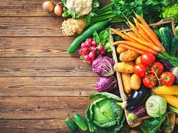
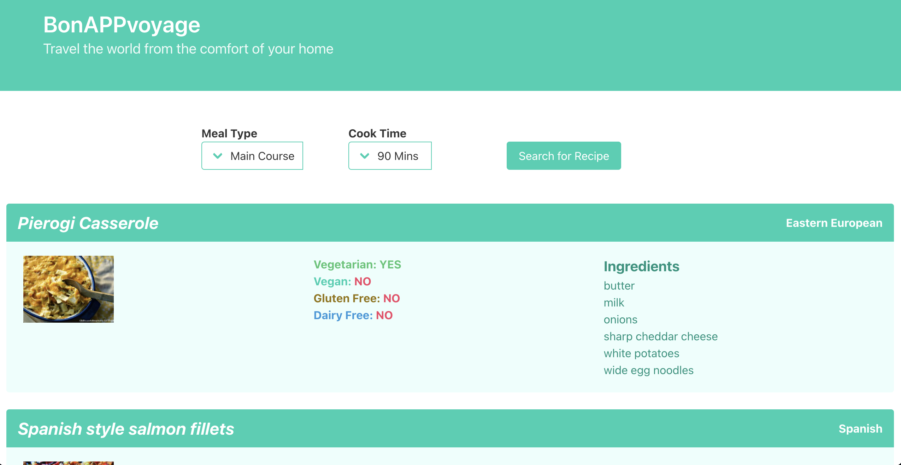

# BonAPPvoyage
Travel the world from the comfort of your home

  

## Description



Bonappvoyage is an app that has been created to help users utilize the ingredients that they have at home. Bonappvoyage helps users find different recipes from around the world. With Covid-19 being on the rise. We want to help users experience traveling from the comfort of their home. This App is user friendly and is fun to use. Bonapvoyage has 2 drop downs that allows you to select the type of meal and cook time followed by a search button that will generate the recipes. After selecting your recipe the user is provided with tourist information in regards of the origin of the meal and the country.
[Demo Video](https://www.youtube.com/watch?v=X3YEamn7x60)



## Features
* Dropdowm menu for Meal Type and Cook time
* Keep track if page was visited with the use of local storage
* Fetch request using APIs
* Responsive user interface

## User Story
```
Given that we are in a pandemic and are encouraged to stay home as much as possible, 
as a person who likes to cook, given that I already have certain ingredients on hand, 
I want to try new recipes from around the world and learn about where they came from.
```

## Acceptance Criteria
```
GIVEN that I have certain ingredients I would like to use for a meal
WHEN I input the meal type and cook time
THEN I am presented with a list of recipes from around the world
WHEN I choose a recipe
THEN I presented with the point of interest of the capital of that country
WHEN I click on the “View Recipe” button
THEN the recipe steps will appear on the screen
WHEN I click on the "Go to Full Recipe" button
THEN the recipe page will open on a new window
```

## Instructions
1. Go to [BonAPPvoyage](https://uoftbootcampgroupproject.github.io/bonAPPvoyage/)
2. Pick meal type and cook time
3. Click on the Search button
4. Scroll on the list of Recipes
5. Select a recipe
6. You will see Points of interest on a particular city of that country
7. Click on the View Recipe button
8. Follow the recipe steps 
9. Click on Full Recipe Button for addition details

## Technologies 
* HTML 5
* JavaScript
* [JQuery](https://jquery.com/)
* [Bulma CSS Framework](https://bulma.io/)
* [Triposo API - To get country facts](https://www.triposo.com/api/documentation/20200803/)
* [Spoonacular API - To get Food Recipes](https://spoonacular.com/food-api)

## Credits
All changes and improvements were implemented by:

* Manuel Leung Chen [GitHub](https://github.com/manuelleungchen)
* Elshie Akindele [GitHub](https://github.com/elshie21)
* Jhonny Lin [GitHub](https://github.com/Jlin72)
* Michael Torontow [GitHub](https://github.com/Torontow)


## License
Copyright \(c\) 2020 UofTbootcampgroupproject

Licensed under the [MIT license](https://github.com/UofTbootcampgroupproject/bonAPPvoyage/blob/main/LICENSE).
